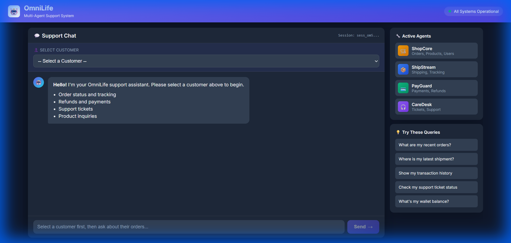
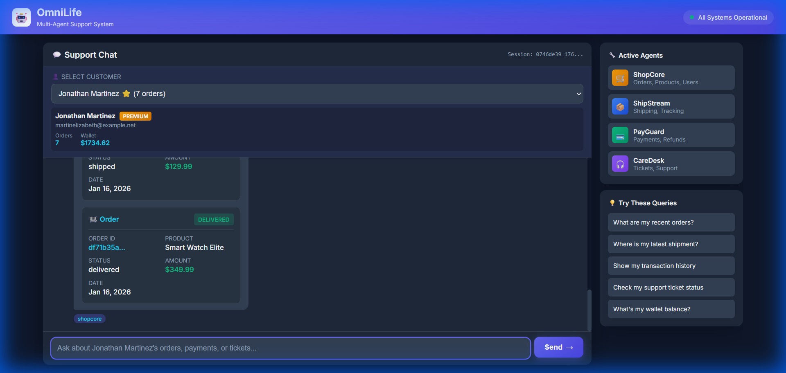
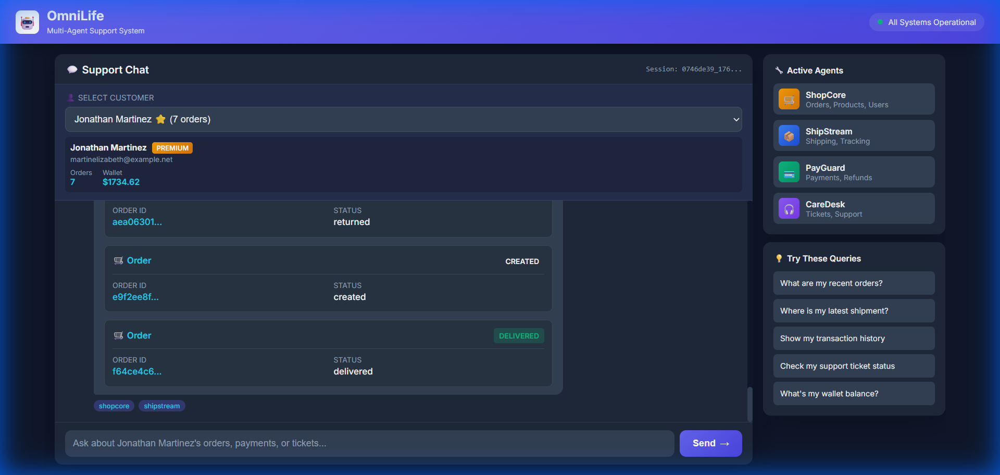

# Multi-Agent Orchestrator

A Hierarchical Multi-Agent System for unified e-commerce customer support using Generative AI.


## Quick Start

```bash
# Install dependencies
pip install -r requirements.txt

# Setup environment
cp .env.example .env
# Edit .env with your GITHUB_TOKEN

# Run migrations
python manage.py migrate

# Generate sample data
python scripts/generate_data.py

# Start server
python manage.py runserver 8000
```

**Open:** http://localhost:8000/

---

## Tech Stack

| Component | Technology |
|-----------|------------|
| **Framework** | Django 4.2 + LangGraph |
| **LLM** | GPT-4o via GitHub Models API |
| **Database** | SQLite (4 virtual databases) |
| **Frontend** | HTML/CSS/JavaScript |
| **State Machine** | LangGraph StateGraph |

---

## Module Hierarchy


---

## Screenshots

### Homepage


### Single Agent Query
> "What are my recent orders?"



### Multi-Agent Query  
> "I ordered a Gaming Monitor but it hasn't arrived. Where is my package?"



---

## Example Queries

| Agents | Example |
|--------|---------|
| **1 Agent** | "What are my recent orders?" |
| **2 Agents** | "I ordered a Laptop. Where is my package?" |
| **3 Agents** | "I ordered a Gaming Monitor but it hasn't arrived. I opened a ticket. Where is my package and has my ticket been assigned?" |

---

## Documentation

| Document | Description |
|----------|-------------|
| [📋 Problem Statement](problem_statement.txt) | Original requirements |
| [🏗️ Architecture](docs/architecture.md) | System design & diagrams |
| [📊 Data Flow](docs/data_flow.md) | Query processing flow |
| [🔌 API Reference](docs/api.md) | REST API endpoints |
| [📐 Diagrams](docs/diagrams.md) | Mermaid visualizations |
| [✅ Implementation Report](docs/implementation.md) | Deliverables checklist |

---

## Project Structure

```
├── apps/
│   ├── orchestrator/    # Super Agent (LangGraph)
│   ├── shopcore/        # E-commerce Agent
│   ├── shipstream/      # Logistics Agent
│   ├── payguard/        # Payments Agent
│   └── caredesk/        # Support Agent
├── api/                 # REST API endpoints
├── docs/                # Documentation
├── scripts/             # Data generation
└── templates/           # Web UI
```

---

## Key Features

- ✅ **4 Specialized Agents** - Text-to-SQL for each domain
- ✅ **Super Agent Orchestration** - LangGraph state machine
- ✅ **Parallel Execution** - ThreadPoolExecutor for agents
- ✅ **Intent Caching** - 40% latency reduction
- ✅ **Pattern Matching** - 60% queries skip LLM
- ✅ **Multi-Intent Detection** - Complex 3-agent queries
- ✅ **Conversation Memory** - MemorySaver checkpointing
- ✅ **Web UI** - Real-time chat interface
