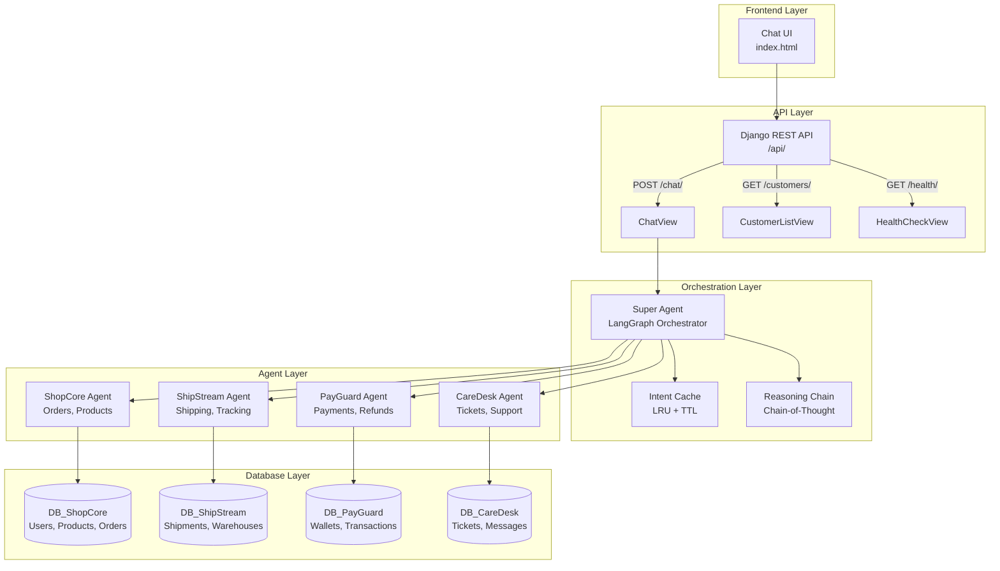
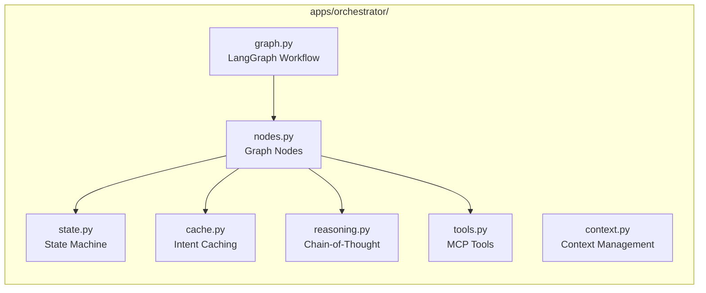
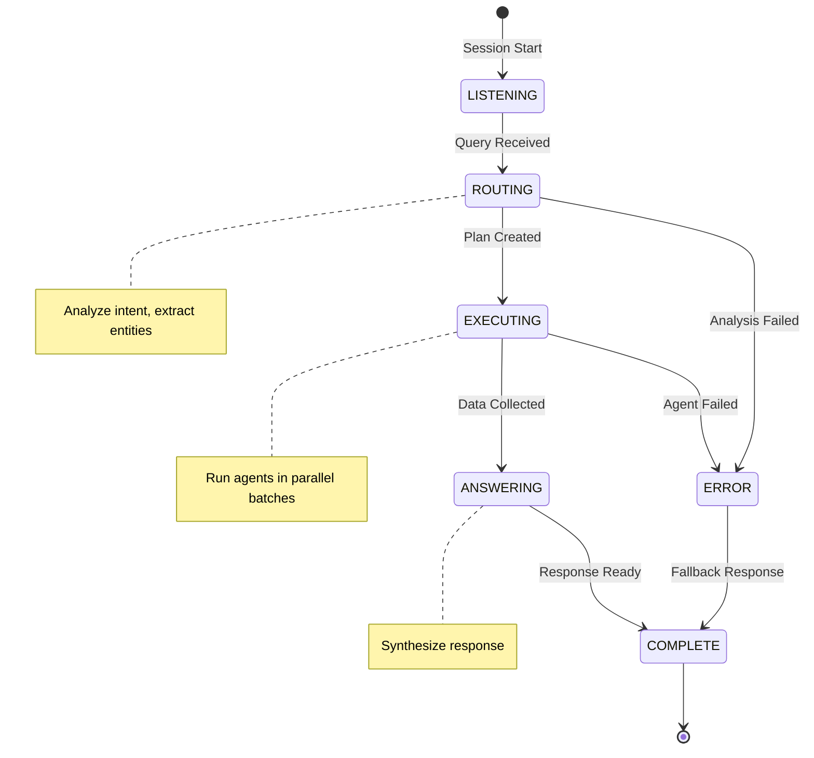

# OmniLife Multi-Agent Orchestrator - Architecture Documentation

## High-Level System Architecture



---

## Component Architecture



---

## State Machine Architecture



---

## Technology Stack

| Layer | Technology |
|-------|------------|
| Frontend | HTML, CSS, JavaScript |
| API | Django REST Framework |
| Orchestration | LangGraph + LangChain |
| LLM | GitHub Models API (GPT-4.1) |
| Database | SQLite (Django ORM) |
| Caching | In-memory LRU |

---

## File Structure

```
Omni-Retail-Multi-Agent-Orchestrator/
├── api/                    # REST API
│   ├── views.py           # API endpoints
│   ├── serializers.py     # Request/response schemas
│   └── urls.py            # URL routing
├── apps/
│   ├── core/              # Shared utilities
│   ├── orchestrator/      # Super Agent
│   │   ├── graph.py       # LangGraph workflow
│   │   ├── nodes.py       # Graph nodes
│   │   ├── state.py       # State machine
│   │   ├── cache.py       # Intent caching
│   │   ├── reasoning.py   # Chain-of-thought
│   │   └── tools.py       # MCP tools
│   ├── shopcore/          # E-commerce agent
│   ├── shipstream/        # Logistics agent
│   ├── payguard/          # Payment agent
│   └── caredesk/          # Support agent
├── config/                # Django settings
├── templates/             # HTML templates
└── scripts/               # Utility scripts
```
