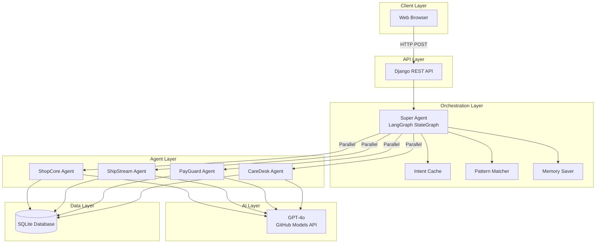
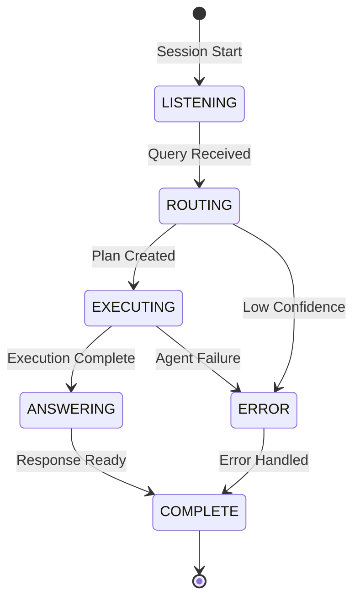
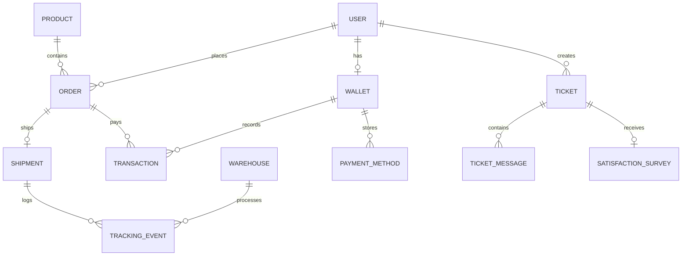

# System Architecture

## High-Level Architecture



---

## State Machine



---

## Tech Stack

| Layer | Technology | Purpose |
|-------|------------|---------|
| **Frontend** | HTML/CSS/JavaScript | Web chat interface |
| **API** | Django REST Framework | HTTP endpoints |
| **Orchestrator** | LangGraph | State machine, workflow |
| **Agents** | LangChain | Text-to-SQL generation |
| **LLM** | GPT-4o (GitHub Models) | Intent classification, SQL generation |
| **Database** | SQLite | 4 virtual databases |
| **Caching** | In-memory LRU | Intent caching |

---

## Component Diagram

```mermaid
graph LR
    subgraph "apps/orchestrator/"
        graph.py[graph.py<br/>LangGraph Workflow]
        nodes.py[nodes.py<br/>Node Functions]
        state.py[state.py<br/>State Schema]
        cache.py[cache.py<br/>Intent Cache]
        reasoning.py[reasoning.py<br/>Chain of Thought]
    end
    
    subgraph "apps/shopcore/"
        sc_agent[agent.py]
        sc_models[models.py]
    end
    
    subgraph "apps/shipstream/"
        ss_agent[agent.py]
        ss_models[models.py]
    end
    
    subgraph "apps/payguard/"
        pg_agent[agent.py]
        pg_models[models.py]
    end
    
    subgraph "apps/caredesk/"
        cd_agent[agent.py]
        cd_models[models.py]
    end
    
    graph.py --> nodes.py
    nodes.py --> state.py
    nodes.py --> cache.py
    nodes.py --> sc_agent & ss_agent & pg_agent & cd_agent
```

---

## Database Schema



---

## Parallel Execution

```mermaid
gantt
    title Agent Execution Timeline
    dateFormat X
    axisFormat %L ms
    
    section Batch 1
    ShopCore :0, 500
    
    section Batch 2
    ShipStream :500, 1000
    CareDesk :500, 1000
    PayGuard :500, 1000
    
    section Synthesis
    Response :1000, 1200
```



---

## Files Structure

```
e:\Omni-Retail-Multi-Agent-Orchestrator\
├── apps/
│   ├── orchestrator/     # Super Agent
│   │   ├── graph.py      # LangGraph workflow
│   │   ├── nodes.py      # Node functions
│   │   ├── state.py      # State schema
│   │   ├── cache.py      # Intent caching
│   │   └── reasoning.py  # Chain of thought
│   ├── shopcore/         # E-commerce Agent
│   ├── shipstream/       # Logistics Agent
│   ├── payguard/         # Payments Agent
│   └── caredesk/         # Support Agent
├── api/                  # REST endpoints
├── docs/                 # Documentation
├── scripts/              # Data generation
└── templates/            # Web UI
```
