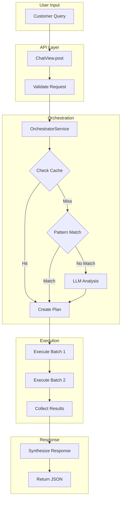
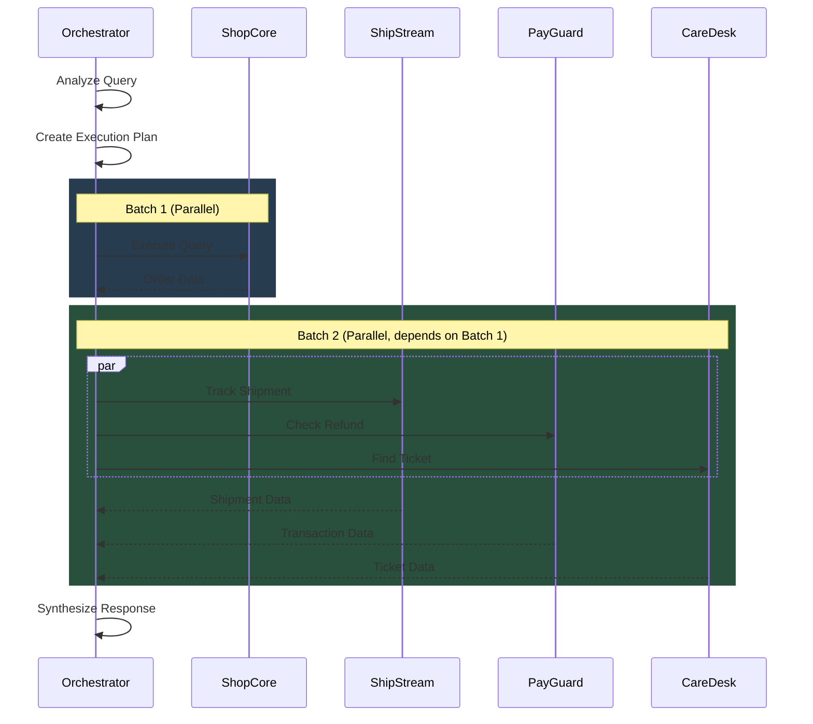
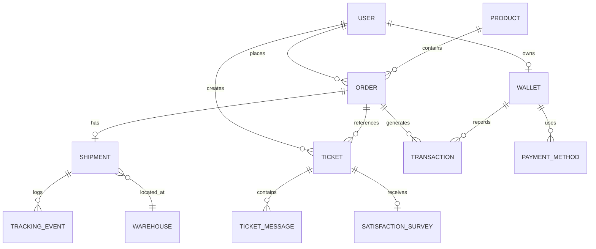
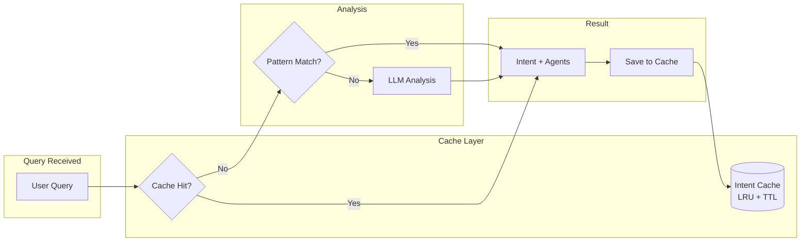
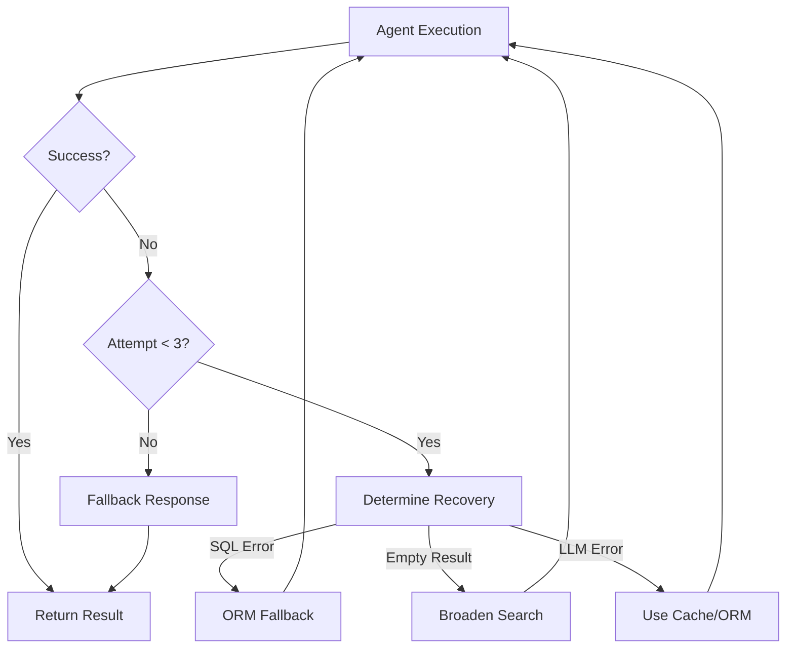

# Data Flow Diagrams

## 1. Query Processing Flow

```mermaid
flowchart TB
    subgraph "User Input"
        A[Customer Query]
    end
    
    subgraph "API Layer"
        B[ChatView.post]
        C[Validate Request]
    end
    
    subgraph "Orchestration"
        D[OrchestratorService]
        E{Check Cache}
        F{Pattern Match}
        G[LLM Analysis]
        H[Create Plan]
    end
    
    subgraph "Execution"
        I[Execute Batch 1]
        J[Execute Batch 2]
        K[Collect Results]
    end
    
    subgraph "Response"
        L[Synthesize Response]
        M[Return JSON]
    end
    
    A --> B --> C --> D
    D --> E
    E -->|Hit| H
    E -->|Miss| F
    F -->|Match| H
    F -->|No Match| G --> H
    H --> I --> J --> K --> L --> M
```

---

## 2. Agent Execution Flow

```mermaid
sequenceDiagram
    participant O as Orchestrator
    participant SC as ShopCore
    participant SS as ShipStream
    participant PG as PayGuard
    participant CD as CareDesk
    
    O->>O: Analyze Query
    O->>O: Create Execution Plan
    
    rect rgb(40, 60, 80)
        Note over O,SC: Batch 1 (Parallel)
        O->>SC: Execute Query
        SC-->>O: Order Data
    end
    
    rect rgb(40, 80, 60)
        Note over O,CD: Batch 2 (Parallel, depends on Batch 1)
        par
            O->>SS: Track Shipment
            O->>PG: Check Refund
            O->>CD: Find Ticket
        end
        SS-->>O: Shipment Data
        PG-->>O: Transaction Data
        CD-->>O: Ticket Data
    end
    
    O->>O: Synthesize Response
```

---

## 3. Database Relationships

```mermaid
erDiagram
    USER ||--o{ ORDER : places
    USER ||--o| WALLET : owns
    USER ||--o{ TICKET : creates
    
    PRODUCT ||--o{ ORDER : contains
    
    ORDER ||--o| SHIPMENT : has
    ORDER ||--o{ TRANSACTION : generates
    ORDER ||--o{ TICKET : references
    
    SHIPMENT ||--o{ TRACKING_EVENT : logs
    SHIPMENT }o--|| WAREHOUSE : located_at
    
    WALLET ||--o{ TRANSACTION : records
    WALLET ||--o{ PAYMENT_METHOD : uses
    
    TICKET ||--o{ TICKET_MESSAGE : contains
    TICKET ||--o| SATISFACTION_SURVEY : receives
```

---

## 4. Cache Flow

```mermaid
flowchart LR
    subgraph "Query Received"
        Q[User Query]
    end
    
    subgraph "Cache Layer"
        H{Cache Hit?}
        C[(Intent Cache<br/>LRU + TTL)]
    end
    
    subgraph "Analysis"
        P{Pattern Match?}
        L[LLM Analysis]
    end
    
    subgraph "Result"
        R[Intent + Agents]
        S[Save to Cache]
    end
    
    Q --> H
    H -->|Yes| R
    H -->|No| P
    P -->|Yes| R
    P -->|No| L --> R
    R --> S --> C
```

---

## 5. Error Recovery Flow

```mermaid
flowchart TB
    E[Agent Execution]
    
    E --> F{Success?}
    F -->|Yes| R[Return Result]
    F -->|No| A{Attempt < 3?}
    
    A -->|Yes| D[Determine Recovery]
    A -->|No| FB[Fallback Response]
    
    D --> |SQL Error| ORM[ORM Fallback]
    D --> |Empty Result| BROAD[Broaden Search]
    D --> |LLM Error| CACHE[Use Cache/ORM]
    
    ORM --> E
    BROAD --> E
    CACHE --> E
    
    FB --> R
```
