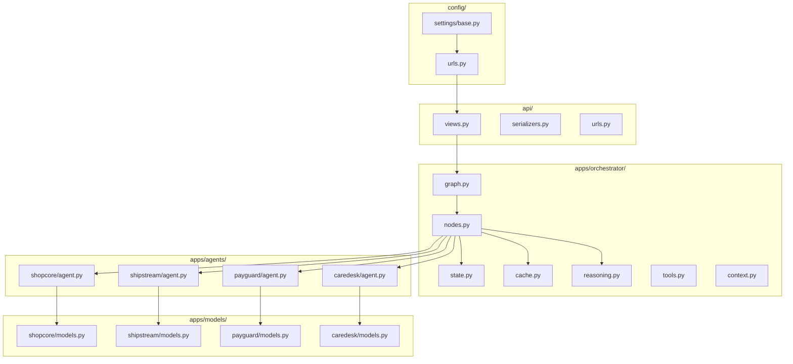
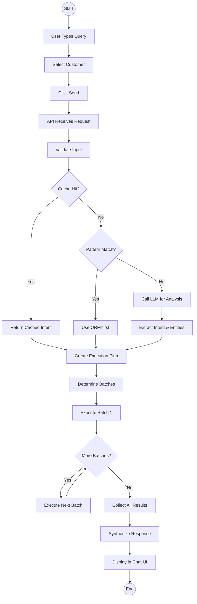
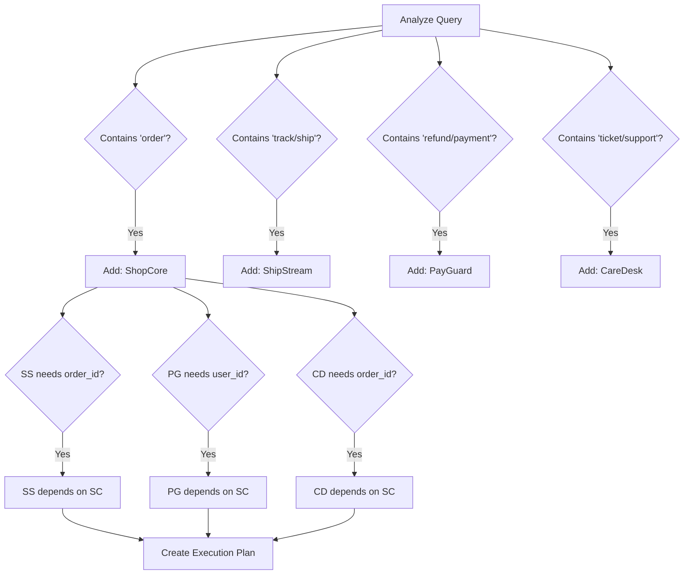
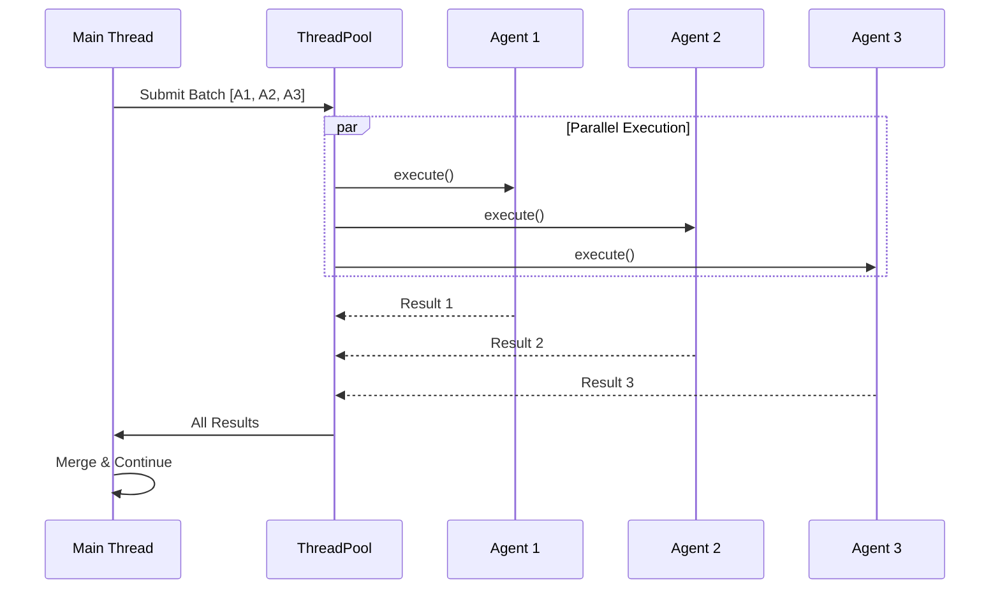

# Module & Activity Diagrams

## 1. Module Hierarchy

---

## 2. Activity Diagram - User Query

---

## 3. Agent Selection Activity

---

## 4. State Transition Activity

```mermaid
flowchart LR
    subgraph "LISTENING"
        L1[Await Query]
        L2[Receive Input]
    end
    
    subgraph "ROUTING"
        R1[Check Cache]
        R2[Pattern Match]
        R3[LLM Analysis]
        R4[Extract Entities]
    end
    
    subgraph "EXECUTING"
        E1[Create Batches]
        E2[Execute Parallel]
        E3[Collect Results]
    end
    
    subgraph "ANSWERING"
        A1[Filter Relevant]
        A2[Synthesize]
        A3[Format Response]
    end
    
    subgraph "COMPLETE"
        C1[Return Response]
    end
    
    L1 --> L2 --> R1
    R1 --> R2 --> R3 --> R4 --> E1
    E1 --> E2 --> E3 --> A1
    A1 --> A2 --> A3 --> C1
```

---

## 5. Parallel Execution Detail

