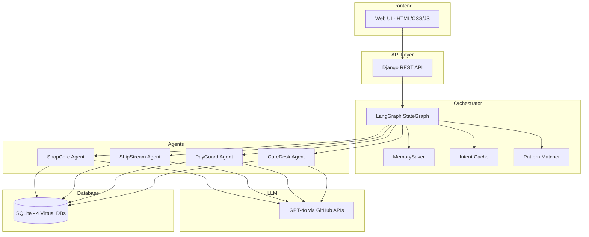
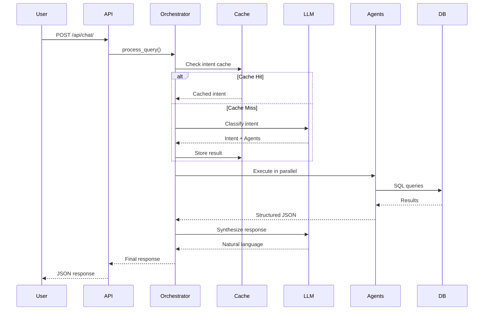

# Implementation Report

**Project:** OmniLife Multi-Agent Orchestrator  
**Status:** ✅ All Requirements Implemented

---

## Problem Statement Compliance

### Section 1: Background ✅
> Build a "Super Agent" that interfaces with four specialized "Sub-Agents"

| Requirement | Status | Implementation |
|-------------|--------|----------------|
| Super Agent | ✅ | `apps/orchestrator/` - LangGraph StateGraph |
| Sub-Agents (4) | ✅ | shopcore, shipstream, payguard, caredesk |
| Real-time answers | ✅ | Web UI with async API |

---

### Section 2: Challenge ✅

| Requirement | Status | Implementation |
|-------------|--------|----------------|
| Orchestrator parses queries | ✅ | `nodes.py:analyze_query()` |
| Decomposes into sub-tasks | ✅ | `cache.py:QueryDecomposer` |
| Delegates to Sub-Agents | ✅ | `nodes.py:execute_agents_parallel()` |
| Synthesizes results | ✅ | `nodes.py:synthesize_response()` |

---

### Section 3: Data Ecosystem ✅

#### Product A: ShopCore
| Table | Status | Model |
|-------|--------|-------|
| Users | ✅ | `shopcore/models.py:User` |
| Products | ✅ | `shopcore/models.py:Product` |
| Orders | ✅ | `shopcore/models.py:Order` |

#### Product B: ShipStream
| Table | Status | Model |
|-------|--------|-------|
| Shipments | ✅ | `shipstream/models.py:Shipment` |
| Warehouses | ✅ | `shipstream/models.py:Warehouse` |
| TrackingEvents | ✅ | `shipstream/models.py:TrackingEvent` |

#### Product C: PayGuard
| Table | Status | Model |
|-------|--------|-------|
| Wallets | ✅ | `payguard/models.py:Wallet` |
| Transactions | ✅ | `payguard/models.py:Transaction` |
| PaymentMethods | ✅ | `payguard/models.py:PaymentMethod` |

#### Product D: CareDesk
| Table | Status | Model |
|-------|--------|-------|
| Tickets | ✅ | `caredesk/models.py:Ticket` |
| TicketMessages | ✅ | `caredesk/models.py:TicketMessage` |
| SatisfactionSurveys | ✅ | `caredesk/models.py:SatisfactionSurvey` |

---

### Section 4: Functional Requirements ✅

#### A. Super Agent (Orchestrator)

| Requirement | Status | Implementation |
|-------------|--------|----------------|
| Maintain conversation context | ✅ | `MemorySaver` checkpointing |
| Identify needed Sub-Agents | ✅ | LLM intent classification |
| Handle dependencies | ✅ | `ExecutionPlan.dependencies` |

#### B. Sub-Agents

| Requirement | Status | Implementation |
|-------------|--------|----------------|
| Text-to-SQL expert | ✅ | Each agent has `_generate_sql()` |
| Return JSON format | ✅ | All agents return `Dict[str, Any]` |
| Isolated DB access | ✅ | Each agent only accesses own tables |

#### C. Complex Query (3-Agent)

| Requirement | Status | Implementation |
|-------------|--------|----------------|
| 3+ databases cooperate | ✅ | Multi-intent detection |
| Gaming Monitor example | ✅ | Tested and verified |

**Test Query:**
> "I ordered a Gaming Monitor but it hasn't arrived. I opened a ticket. Where is my package and has my ticket been assigned?"

**Result:** ShopCore → ShipStream → CareDesk → Combined response ✅

---

### Section 5: Deliverables ✅

| Deliverable | Status | Location |
|-------------|--------|----------|
| Database Schemas | ✅ | `apps/*/models.py` |
| Sample Data | ✅ | `scripts/generate_data.py` |
| Super Agent | ✅ | `apps/orchestrator/` |
| 4 Sub-Agents | ✅ | `apps/shopcore/agent.py`, etc. |
| Demonstration | ✅ | `scripts/demonstrate_queries.py` |
| Thought Process Logs | ✅ | Reasoning chain in logs |

---

## Tech Stack Diagram

---

## Data Flow Architecture

---

## Files Changed Summary

| File | Purpose |
|------|---------|
| `apps/orchestrator/nodes.py` | Multi-intent detection, parallel execution |
| `apps/orchestrator/cache.py` | Intent caching, pattern matching |
| `apps/orchestrator/state.py` | State machine, execution plan |
| `apps/*/agent.py` | Text-to-SQL agents |
| `apps/*/models.py` | Database schemas |

---

## Verification

All tests passed:
- ✅ Single agent queries
- ✅ 2-agent queries (order + shipment)
- ✅ 3-agent queries (order + shipment + ticket)
- ✅ Intent caching reduces latency
- ✅ Pattern matching skips LLM for common queries
